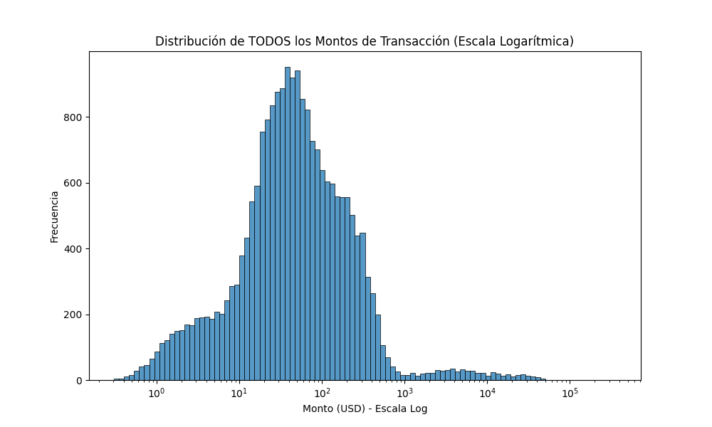
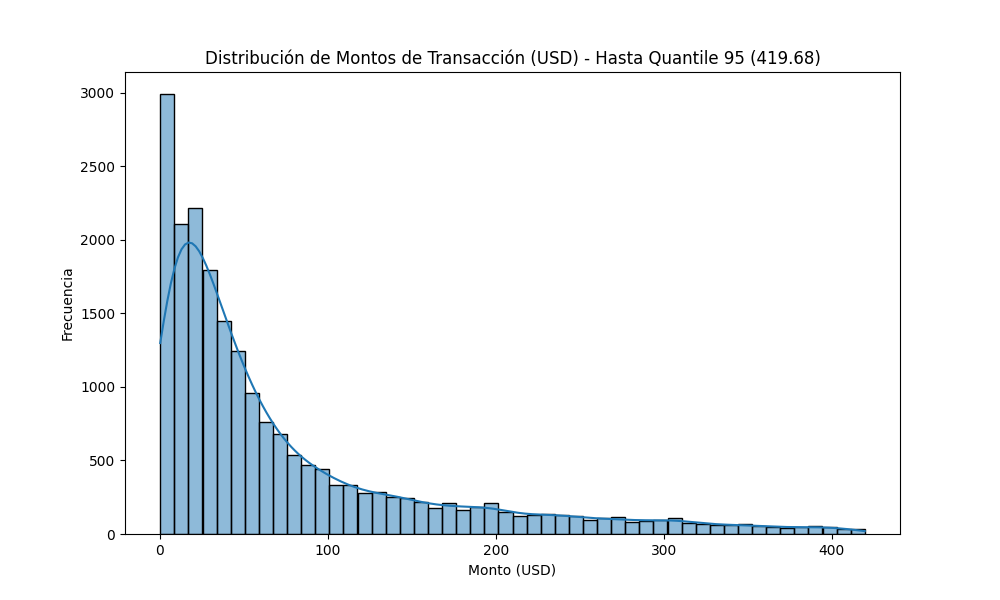
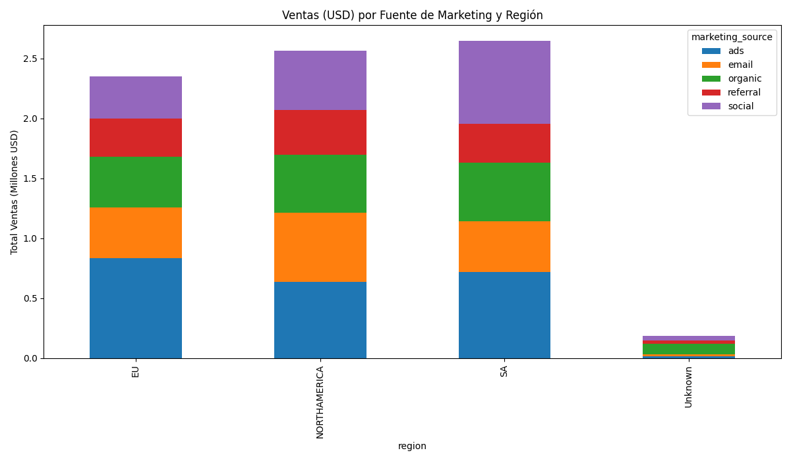
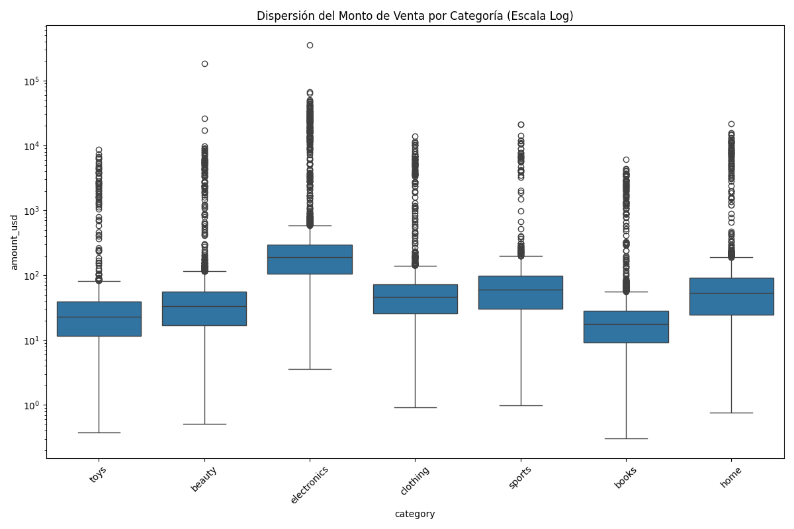
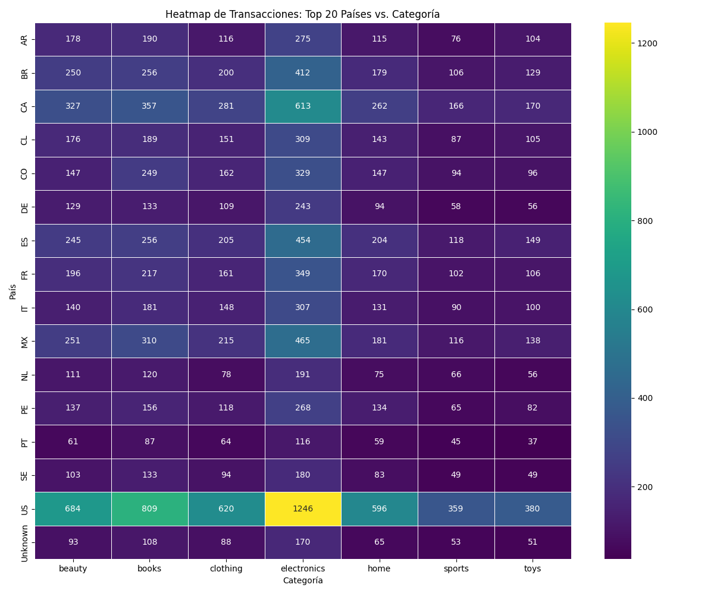
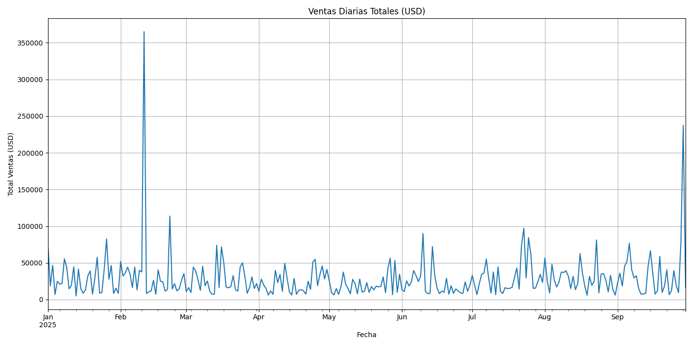
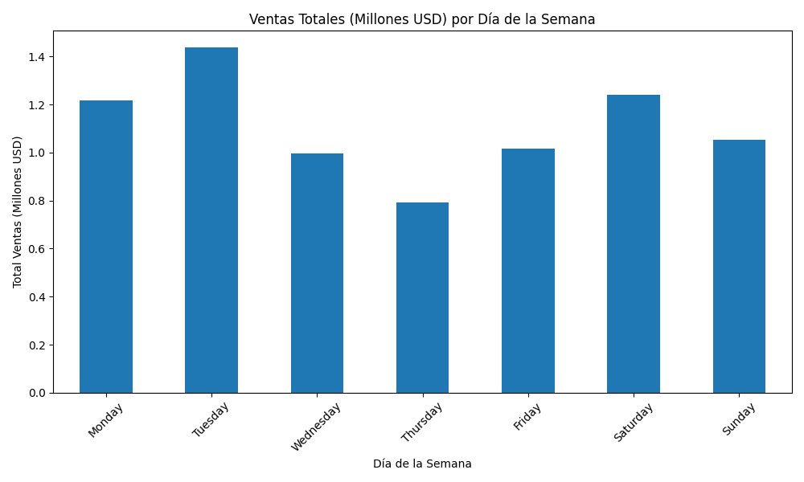

# Análisis Exploratorio de Datos (EDA) y Hallazgos del Pipeline

Este documento detalla el proceso de análisis y limpieza realizado en dos fases.

1.  **EDA Inicial (`etl/EDA.py`)**: Un pre-procesamiento que limpia los datos crudos (`data/raw`) y los prepara en una zona intermedia (`data/staging`).
2.  **EDA Final (`etl/EDA_FINAL.py`)**: Un post-procesamiento que analiza los artefactos finales (`data/output`), genera visualizaciones y extrae conclusiones.

---

## 1. Calidad de Datos (Fase 1: `EDA.py`)

La calidad de los datos crudos fue el principal desafío, requiriendo una limpieza robusta en `EDA.py`. Los logs de `initial_cleaning_and_eda` revelan las siguientes métricas:

### Nulos
Se identificaron valores nulos en múltiples archivos:
* **`transactions.csv`**: Se encontraron nulos en columnas críticas. El log muestra:
    ```
    [EDA Txns] Nulos críticos (antes): 
    customer_id    118
    product_id      70
    ts               0
    amount           0
    ```
    Dado que estas filas son inutilizables para el análisis, **fueron eliminadas 188 filas**.
* **`customers.csv`**: Se encontraron nulos en la columna `country`. El log muestra:
    ```
    [EDA Cust] Nulos reales en 'country': 105
    ```
    Para no perder clientes, estos 105 valores fueron **imputados** con el string `"Unknown"`.

### Duplicados por `txn_id`
El dataset `transactions.csv` contenía transacciones duplicadas.
* **Proceso**: Se utilizó `drop_duplicates(subset=['txn_id'], keep='first')` para asegurar la unicidad.
* **Hallazgo**: Los logs confirman la eliminación de duplicados:
    ```
    INFO - [EDA Txns] Filas iniciales: 22350
    INFO - [EDA Txns] Transacciones duplicadas (txn_id): 350
    INFO - [EDA Txns] Filas post-deduplicación: 22000
    ```

### Fechas Inválidas
La columna `ts` (timestamp) en `transactions.csv` contenía formatos mixtos y valores corruptos.
* **Proceso**: Se utilizó `pd.to_datetime(..., errors='coerce')`. Las filas que no pudieron ser parseadas (resultando en `NaT`) fueron eliminadas.
* **Hallazgo**: El log muestra que no se eliminaron filas por esta causa.

### Outliers y Limpieza de Montos (`amount`)
La columna `amount` (en moneda local) estaba en formato de texto, con símbolos (`$`, `€`) y comas decimales.
* **Proceso**: Se aplicó una limpieza (reemplazando `[$,€]` por `''` y `,` por `.`) y se convirtió a numérico.
* **Hallazgo**: El log indica que **0 filas** fueron eliminadas por montos inválidos, lo que significa que la limpieza fue 100% exitosa.
* **Análisis de Outliers (Moneda Local)**: El análisis descriptivo de la columna `amount` (antes de la conversión a USD) muestra:
    ```
    50%          58.370000
    99%        9308.340000
    ...
    [EDA Txns] Conteo de outliers (amount > 38318.50): 22
    ```
    Esto indica que el 99% de las transacciones son menores a $9308.34, pero existen al menos 22 transacciones extremas superiores a $38318.5.

---

## 2. Monedas

### Normalización a USD (Fase 1)
La normalización de moneda es un paso crítico realizado en `EDA.py`.
* **Proceso**: Se cargó `exchange_rates.csv`, se unió con las transacciones y se creó la columna `amount_usd = amount * rate_to_usd`.
* **Hallazgo (Distribución USD)**: El log `initial_cleaning_and_eda` proporciona las estadísticas descriptivas para la nueva columna `amount_usd` sobre las filas limpias:
    ```
    [EDA Txns] Distribución de 'amount_usd': 
    count     21812.000000
    mean        355.290831
    std        3534.985751
    min           0.306240
    25%          18.391800
    50%          44.485200
    75%         119.045000
    max      358032.960000
    ```
    Notablemente, la media ($355.3) es casi 8 veces la mediana ($44.49), confirmando una distribución con una fuerte cola derecha (skewed right).

### Visualización de Distribución (Fase 2)
Para entender esta distribución, `EDA_FINAL.py` genera dos histogramas:
1.  **Histograma (Escala Logarítmica)**: Muestra la distribución completa, confirmando la "larga cola" (long tail) de transacciones de alto valor.
2.  **Histograma (Quantile 95%)**: Muestra la "cabeza" de la distribución, es decir, la gran mayoría de las transacciones.




---

## 3. Clientes

### Cohortes por `signup_ts` (Fase 1)
El script `EDA.py` realiza un análisis de cohortes preliminar para entender la adquisición de clientes.
* **Proceso**: Se agruparon los clientes de `customers.csv` por `signup_month` (Mes de registro).
* **Hallazgo**: El log `initial_cleaning_and_eda` muestra los siguientes conteos de nuevos clientes por mes:
    ```
    [EDA Cust] Análisis de Cohortes (nuevos clientes/mes): 
    signup_month
    2025-05    285
    2025-06    275
    2025-07    287
    2025-08    306
    2025-09    268
    Freq: M, dtype: int64
    ```

### Marketing Source por Región (Fase 2)
El script `EDA_FINAL.py` genera una visualización clave que cruza las ventas (USD) por región y fuente de marketing.
* **Hallazgo Clave**: El log `final_analysis_and_reporting` confirma que **SOUTHAMERICA es el mercado más grande**:
    ```
    [Insight Cliente] La región 'SA' (south america) es el mercado más grande.
    ```
* **Tabla de Ventas (USD) por Región y Fuente**:
    ```
    [log de final_analysis_and_reporting]
    marketing_source           ads         email       organic      referral        social
    region                                                                                
    EU                833369.70812  421755.08746  423536.57092  319667.62084  353924.57626
    NORTHAMERICA      633585.09552  580256.38996  484099.53696  371942.71196  495903.90388
    SA                716822.43538  424282.61842  491472.35044  323648.38040  690514.12306
    Unknown            14952.02494   19522.56798   84279.95316   30139.00772   35928.95242
    ```
* **Visualización**: El gráfico de barras apiladas (corregido para mostrar "Millones USD") ilustra este hallazgo visualmente.



---

## 4. Productos

### Ticket Medio y Dispersión por Categoría (Fase 2)
* **Hallazgo Clave**: El log `final_analysis_and_reporting` identifica la categoría más importante por ingresos:
    ```
    INFO - [Insight Producto] La categoría 'electronics' es la que más ingresos genera.
    ```
* **Tabla de Agregación por Categoría**:
    ```
    [final_analysis_and_reporting]
                       mean           sum  count
    category                                    
    electronics  854.699221  5.065802e+06   5927
    home         253.610031  6.690233e+05   2638
    beauty       206.987973  6.681572e+05   3228
    clothing     182.549699  5.129647e+05   2810
    sports       222.717343  3.674836e+05   1650
    books         68.316211  2.562541e+05   3751
    toys         116.105373  2.099185e+05   1808
    ```
    `ELECTRONICS` no solo tiene el mayor volumen de ventas (`sum`), sino también el `mean` (ticket medio) más alto con $854.7.
* **Visualización**: El boxplot con escala logarítmica confirma que `electronics` y `home` tienen la mayor dispersión y los tickets medios más altos.



### Combinaciones Anómalas `country × category` (Fase 2)
Para identificar patrones de compra, se generó un heatmap (Top 20 países vs. Categoría).
* **Hallazgos**:
    * **Concentraciones Fuertes**: El heatmap muestra puntos calientes (amarillos) claros, destacando la alta demanda de `electronics` y `books` en `USA`.
    * **Oportunidades (Zonas Oscuras)**: Muestra una actividad notablemente baja para categorías como `sports` y `toys` en la mayoría de los países, lo que podría indicar una oportunidad de mercado o de cross-selling.



---

## 5. Análisis Temporal

### Picos y Caídas por Día (Fase 1 y 2)
* **Proceso**: `EDA.py` analizó las ventas diarias agregadas, `EDA_FINAL.py` las graficó.
* **Hallazgo Clave (Anomalía)**: Se detectó un pico de ventas masivo.
    * El log `initial_cleaning_and_eda` muestra un `max` de **$331512** en ventas diarias, comparado con una media de **$426.22**.
    * El log `final_analysis_and_reporting` identifica la fecha exacta:
        ```
        [Insight Temporal] El día pico de ventas fue 2025-02-11.
        ```
* **Visualización**: El gráfico de líneas temporales muestra claramente esta anomalía extrema el 11 de febrero de 2025, que distorsiona el resto de la gráfica y debe ser investigada (¿un evento de ventas, un error de datos, una carga masiva?).



### Patrones por Día de la Semana (Fase 2)
* **Proceso**: `EDA_FINAL.py` agregó las ventas por día de la semana (`weekday`).
* **Hallazgo Clave**: El log `final_analysis_and_reporting` identifica el día más fuerte:
    ```
    INFO - [Insight Temporal] El día de la semana con más ventas es Tuesday.
    ```
* **Tabla de Ventas por Día de la Semana**:
    ```
    [final_analysis_and_reporting]
    weekday
    Monday       1.215972e+06
    Tuesday      1.436584e+06
    Wednesday    9.962449e+05
    Thursday     7.933911e+05
    Friday       1.014841e+06
    Saturday     1.240816e+06
    Sunday       1.051753e+06
    ```
    El martes es el líder claro. El jueves parece ser el día más lento.
* **Visualización**: El gráfico de barras confirma este patrón semanal.


